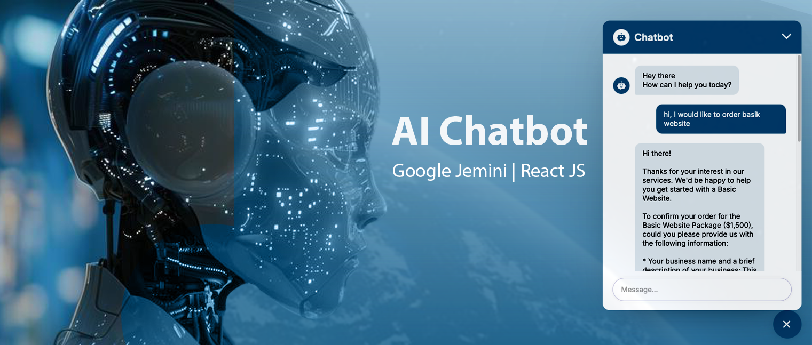

# AI Chatbot

This project features an AI-powered chatbot built with React JS and CSS, designed to provide accurate answers based on a predefined set of company information. The chatbot dynamically generates responses using the Google Gemini API and can answer questions that are relevant to the data available in the companyInfo.js file, in addition to providing cost estimates for website packages.

## Google Gemini + React JS + Vite

React JS: For building the user interface and managing state.
CSS: For styling and ensuring a responsive design.
Google Gemini API: For generating dynamic AI-powered responses.
React Icons: For displaying custom icons in the user interface.
companyInfo.js: A JavaScript file containing all the relevant information the chatbot uses to answer questions.

This template provides a minimal setup to get React working in Vite with HMR and some ESLint rules.

Currently, two official plugins are available:

- [@vitejs/plugin-react](https://github.com/vitejs/vite-plugin-react/blob/main/packages/plugin-react/README.md) uses [Babel](https://babeljs.io/) for Fast Refresh
- [@vitejs/plugin-react-swc](https://github.com/vitejs/vite-plugin-react-swc) uses [SWC](https://swc.rs/) for Fast Refresh

### Expanding the ESLint configuration

If you are developing a production application, we recommend using TypeScript and enable type-aware lint rules. Check out the [TS template](https://github.com/vitejs/vite/tree/main/packages/create-vite/template-react-ts) to integrate TypeScript and [`typescript-eslint`](https://typescript-eslint.io) in your project.

#### How It Works

1.The user interacts with the chatbot by asking questions related to the company or website packages.
2.The chatbot uses the Google Gemini API to generate dynamic responses based on the input.
3.It can provide cost estimates for website packages such as Basic, E-commerce, and Premium(like in the current companyInfo)
4.For questions related to company information, the chatbot fetches relevant details from the companyInfo.js file to provide accurate answers.
5.The chatbot intelligently parses user input to identify which type of response is needed (cost estimate or information retrieval from companyInfo.js).

##### Key Features

1.Input box for sending messages to the chatbot.
2.Dynamic, AI-generated responses are displayed in real-time.
3.Loading indicators while waiting for responses.
4.Toggleable chatbot popup for easy access.

###### Installation

Install dependencies: npm install
Start the development server: npm run dev
add .env file in root with VITE_API_URL="your api key" ("your api key you can get https://aistudio.google.com/app/apikey)
